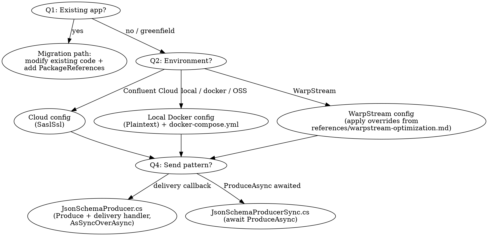

<HARD-GATE>
Do NOT generate any code, scaffold any project, or modify any file until Step 1 AND
Step 1b below are both complete: every open question (#1 existing app or greenfield,
#2 target environment, #3 producer/consumer/both, etc.) has been asked and answered,
and the user has confirmed a final recap. This applies to EVERY prompt regardless of
how specific it appears -- even a fully-specified prompt still needs the Step 1b
recap-and-confirm turn before you generate; it just means Step 1b happens in your
first reply instead of a later one.
</HARD-GATE>

Begin by announcing: "Using the Confluent Kafka .NET Client skill to guide this project."

# Confluent Kafka .NET Client Creation

Generate a production-ready .NET project for producing to and/or consuming from Kafka using
`Confluent.Kafka` with Confluent Schema Registry serializers. Supports three target environments:
**Confluent Cloud** (managed), **Local Docker**, and **WarpStream** (Kafka-compatible,
object-storage-backed); and three schema formats: **JSON Schema** (default), **Avro**, and
**Protobuf**. The generated code follows Confluent's best practices.

## ⚠️ IMPORTANT: Lazy-Load References Only
**Do NOT read all files in `references/` upfront. Read only the ones the current step needs.**

- Gathering requirements (Step 1) needs no reference file yet -- the questions below are self-contained.
- Generating a producer/consumer needs only the one or two `.cs` templates for the chosen send
  pattern and format (e.g. `references/JsonSchemaProducer.cs`), not every template in the directory.
- WarpStream tuning, the consumer commit-strategy tradeoffs, multi-event unions, and the
  post-generation run instructions each live in their own reference file -- open the one that matches
  what you're doing right now, not all of them "just in case."

## Step 1: Gather Requirements

Before generating any code, work through the questions below. **Skip *re-asking* any question the
user has already answered explicitly in their prompt** -- but always echo back what you understood
for those answered questions in the same reply (a short "Got it: ..." lead-in), rather than silently
dropping them. This is what the HARD-GATE means by "still confirm your understanding" for
partially-answered prompts: you're not asking it again, you're surfacing your interpretation of it so
the user can correct a misread before you go further. For example, for "build a producer and consumer
on Confluent Cloud with fire-and-forget style sends" (which already answers #2, #3, and #4), open your
reply with something like "Got it -- Confluent Cloud, producer + consumer, delivery-callback sends,"
then ask only about #1, #5, #6, #7, and #8.

Do not assume defaults for #1, #2, or #3 -- if any of these are not answered by the prompt, you must ask.

If the prompt leaves nothing open (every question below is answered or has an unambiguous default),
your first reply's "Got it: ..." echo already contains everything Step 1b needs, so fold Step 1b's
full recap format into that same first message and wait for confirmation there -- don't send a second
"just checking" message first. Otherwise, ask the remaining open questions now and move to Step 1b
once the user answers them.

1. **Are you adding Kafka to an existing application, or starting from scratch?**
   - If the user has an existing .NET project (mentions a `.csproj`/`.sln`, ASP.NET Core, a Worker
     Service, Blazor, etc.), do **not** scaffold a competing project. Instead: (a) identify their
     existing producer or data-sending code, (b) ask whether they already have schemas registered in
     Schema Registry, (c) add Schema Registry integration to their existing code following the
     patterns in the reference files. Generate only the files they are missing (e.g., `KafkaConfig.cs`,
     `Value.cs`) and modify their existing code inline. Add the `Confluent.Kafka` /
     `Confluent.SchemaRegistry.Serdes.*` package references to their existing `.csproj`.
   - **If they haven't shown you their `.csproj`** (e.g., they pasted a class but not the project
     file), ask them to paste it -- or just its `<ItemGroup>` of `<PackageReference>`s -- before you
     touch package references. Do **not** invent a new wrapper `.csproj` around their class as a
     stand-in; that recreates the exact "competing project" problem this rule exists to avoid, and it
     leaves their real project un-migrated. While you wait, you can still tell them precisely which
     `<PackageReference Include="..." Version="..." />` line(s) to add by hand.
   - If the user already produces to Kafka without Schema Registry (e.g., hand-rolled
     `JsonSerializer.Serialize` into a `string`/`byte[]` value), help them migrate: (1) generate a
     schema from their existing message shape, (2) register it, and (3) replace their raw
     serialization with a Confluent Schema Registry serializer. Do not discard their existing code.
   - If starting from scratch, proceed with the full scaffold below.
2. **Target environment?** -- Confluent Cloud, local Kafka (Docker), or WarpStream. **Always prompt
   for this, even if the user didn't mention it.** If they mention "local", "docker", "self-hosted",
   or just want to try Kafka without a cloud account, choose **local Docker**. If they mention
   "Confluent Cloud", "CC", or have existing cloud credentials, choose **Confluent Cloud**. If they
   mention "WarpStream", choose **WarpStream**. Default to Confluent Cloud if they confirm they don't
   have a preference, but always ask first.
   - **If WarpStream:** Read `references/warpstream-optimization.md` and apply the librdkafka
     overrides from that reference (Confluent.Kafka is a librdkafka wrapper, same as
     confluent-kafka-python). Key changes: disable idempotence, dramatically increase batch sizes and
     in-flight requests, set large fetch sizes, add `ws_az=<az>` to `ClientId` for zone-aware routing.
     Prefer null message keys for sticky partitioning unless entity-based ordering is required.
3. **Producer, consumer, or both?**
4. **Send pattern?** (Only if producer is requested.) Help the user choose:
   - **Delivery-handler callback** (recommended default): `producer.Produce(topic, message,
     deliveryHandler)`. Non-blocking; the `Action<DeliveryReport<TKey,TValue>>` callback handles
     per-record delivery reports and errors. Best throughput for most applications. Use
     `references/JsonSchemaProducer.cs`.
   - **`ProduceAsync` awaited per record**: `await producer.ProduceAsync(topic, message)`. Confirms
     each write before the next -- simplest error handling (a normal `try`/`catch` around the
     `await`), lowest throughput. Best for batch/ETL scripts and steps that must confirm one write
     before the next. Use `references/JsonSchemaProducerSync.cs`.
   If the user mentions batch, ETL, or "confirm each write", default to **`ProduceAsync` awaited**.
   Otherwise default to **delivery-handler callback**.
5. **Do you have an existing schema you'd like to use?** If yes, ask the user to paste it or provide
   the file path, then use it instead of generating one. If no, proceed to ask about their data fields.
6. **What kind of data are you producing?** (Only if the user doesn't have an existing schema. Get
   field names and types so you can generate a matching schema and sample data.)
7. **Topic name?** (Default: `demo-topic`)
8. **Consumer group ID?** (Only if consumer; default: `dotnet-consumer-group`)

Don't ask whether to use Schema Registry -- always include it. **Default to JSON Schema** (the
Confluent .NET client validates and generates it code-first from a plain C# class via NJsonSchema, no
codegen step required). Offer Avro or Protobuf if the user prefers -- ask only if they hint at a
preference; otherwise use JSON Schema. If the target is WarpStream and the user is using WarpStream's
built-in schema registry, note that it only supports Avro and Protobuf (`GET /schemas/types` returns
`["AVRO","PROTOBUF"]`) -- ask whether they prefer Avro (default) or Protobuf in that case.

### Common Agent Mistakes

| Thought | Reality |
|---------|---------|
| "I'll set the serializer with `.SetValueSerializer(jsonSerializer)` for both `Produce()` and `ProduceAsync()`" | `Produce()` (the delivery-callback style) requires a **synchronous** `ISerializer<T>`. Confluent's Schema Registry serializers (`JsonSerializer<T>`, `AvroSerializer<T>`) implement `IAsyncSerializer<T>` -- wrap with `.AsSyncOverAsync()` (`using Confluent.Kafka.SyncOverAsync;`) before passing to `Produce()`. `ProduceAsync()` takes the async serializer directly -- do NOT wrap it there, or you lose the async path. Same applies to deserializers on the consumer side: `IConsumer<TKey,TValue>.SetValueDeserializer` only accepts `IDeserializer<T>`, so `JsonDeserializer<T>`/`AvroDeserializer<T>` always need `.AsSyncOverAsync()`. |
| "I'll port Java's `consumer.wakeup()` + `WakeupException` shutdown pattern" | .NET doesn't have `wakeup()`. Use a `CancellationToken`: `consumer.Consume(cancellationToken)` throws `OperationCanceledException` when the token is cancelled. Wire it to `Console.CancelKeyPress` (or the host's `IHostApplicationLifetime` if integrating into an existing app). |
| "JSON Schema needs a `.schema.json` file like Java/Python, generated ahead of time" | .NET's JSON Schema path is **code-first**: `Value.cs` (a plain C# class with `[Description]`/`[Required]` attributes) is the source of truth, and `NJsonSchema.JsonSchema.FromType<Value>()` derives the schema at registration time. This is the opposite direction from Avro/Protobuf, where the schema file is the source of truth and the C# class is generated FROM it. |
| "I'll generate the whole project in one file with one `Main`" | Multiple classes can each define `static Main` in the same project (mirrors Java's multiple classes each with `main`, selected via `-Dexec.mainClass`). Set `<StartupObject>` in the `.csproj` (or pass `-p:StartupObject=...` to `dotnet run`) to pick which one runs. Don't merge the producer and consumer into one dispatcher class unless the user asks for that. |
| "I'll add a Share Consumer / queue-group option, the way the Java skill does" | The .NET client does not currently support Kafka's Share Consumer API (KIP-932, "Queues for Kafka") -- that's Java-client-only as of Kafka 4.x. If the user wants queue-like cooperative consumption beyond partition count, tell them it isn't available via `Confluent.Kafka` yet and point them at `developing-kafka-java-client`. Don't fabricate a Share Consumer example. |
| "I'll leave `AutoRegisterSchemas` at its default" | The serializer config default is `true`. Always set it to **`false`** and register explicitly via `schemaRegistryClient.RegisterSchemaAsync(...)`. Silent auto-registration is a production hazard. |
| "I'll construct a new `IProducer` inside the send method" | One producer instance, created once (in `Main` or via DI in an existing host), passed as an `IProducer<TKey,TValue>` parameter. Producers are thread-safe and expensive to create. |
| "Avro just needs the `.avsc` file present at run time" | Avro C# classes are generated **ahead of build** by the `avrogen` CLI tool (`dotnet tool install --global Apache.Avro.Tools`, then `avrogen -s Avro/value.avsc Avro/`) -- there is no MSBuild-integrated codegen step for Avro the way there is for Protobuf (`Grpc.Tools`). Remind the user to re-run `avrogen` after editing the schema. |
| "I'll catch and swallow all exceptions from `Consume()`" | Catch `OperationCanceledException` narrowly (expected shutdown signal) and `ConsumeException` for per-poll errors (log and continue the loop). Let unexpected exceptions propagate. |
| "The old `group.protocol=consumer` string needs `.Set(...)`" | `ConsumerConfig` has a typed `GroupProtocol` property (`GroupProtocol.Consumer` / `GroupProtocol.Classic`) for KIP-848 -- use the typed property, not a raw string `.Set()` call. |

## Step 1b: Confirm Understanding

Once every question is answered (either from the original prompt or the user's reply to Step 1),
present this confirmation summary before generating any code -- in the same message as Step 1's "Got
it: ..." echo if nothing was left open, otherwise as your next reply after the user fills the gaps:

```
Before I generate the project, let me confirm:
- Project type: [Greenfield scaffold / Migration of existing code]
- Environment: [Confluent Cloud (SASL_SSL) / Local Docker (PLAINTEXT) / WarpStream]
- Schema format: [JSON Schema (default) / Avro / Protobuf]
- Components: [Producer only / Consumer only / Both]
- Send pattern: [Delivery-handler callback / ProduceAsync awaited] (if producer)
- Schema: [brief description of user's data fields]
- Topic: [topic name]
- Consumer group: [group ID] (if consumer)

Does this look right?
```

Wait for user confirmation before proceeding to Step 2. If the user corrects anything, update your
understanding and re-confirm.

## Step 2: Generate the Project

### Decision Flowchart



Create this file structure in the user's chosen directory:

```
<project-dir>/
├── <ProjectName>.sln
├── docker-compose.yml               # (local Docker path only)
├── appsettings.json.example         # template for credentials
├── README.md
├── src/
│   └── <ProjectName>/
│       ├── <ProjectName>.csproj
│       ├── KafkaConfig.cs           # shared config loading + connectivity verification
│       ├── Value.cs                 # (JSON Schema path) code-first POCO
│       ├── Avro/value.avsc          # (Avro path) schema-first; avrogen generates the class
│       ├── JsonSchemaProducer.cs    # (if producer; or JsonSchemaProducerSync.cs / AvroProducer.cs)
│       └── JsonSchemaConsumer.cs    # (if consumer; or AvroConsumer.cs)
└── tests/
    └── <ProjectName>.Tests/
        ├── <ProjectName>.Tests.csproj
        └── AppTests.cs              # unit tests (always generated)
```

### Security

NEVER read, open, or display `appsettings.json`. It contains API keys and secrets. Only generate
`appsettings.json.example` with placeholder values. If the user asks you to debug a connection issue,
ask them to verify their `appsettings.json` values themselves -- do not read the file. Add
`appsettings.json` to `.gitignore`.

### Core Principles

These principles matter because they prevent the most common production issues with Kafka .NET clients:

1. **Reuse the producer/consumer instance.** Creating an `IProducer` per message is expensive --
   each one opens TCP connections, does SASL handshakes, and fetches metadata. Producers are
   thread-safe; create one and share it. The send helper accepts the producer as a parameter, never
   instantiates one.

2. **Always use Schema Registry, with JSON Schema by default.** Schema Registry enforces a
   producer/consumer contract; without it, schema changes silently break consumers. This skill
   defaults to **JSON Schema** because it needs no codegen step -- `Value.cs` is a plain C# class and
   the schema is derived from it via `NJsonSchema.JsonSchema.FromType<T>()`. Avro and Protobuf are
   supported alternatives (schema-first: the schema file is the source of truth and the C# class is
   generated from it).

   **Register schemas as a separate explicit step** before producing. Use a dedicated
   `RegisterSchemaAsync()` helper that calls `schemaRegistryClient.RegisterSchemaAsync(subject,
   schema)` and lets errors (auth failures, network errors, permission denials) propagate immediately
   -- never swallow them. Then configure the serializer with `AutoRegisterSchemas = false` and
   `UseLatestVersion = true`. This ensures the serializer never silently auto-registers and aligns
   with production practice where CI/CD registers schemas, not application startup.

   Use the serializer matching the chosen format:
   - **JSON Schema (default):** `Confluent.SchemaRegistry.Serdes.JsonSerializer<T>` /
     `JsonDeserializer<T>`. See `references/JsonSchemaProducer.cs` / `references/JsonSchemaConsumer.cs`.
   - **Avro:** `Confluent.SchemaRegistry.Serdes.AvroSerializer<T>` / `AvroDeserializer<T>`, where `T`
     is the class generated by `avrogen` from the `.avsc` (implements `Avro.Specific.ISpecificRecord`).
     See `references/AvroProducer.cs` / `references/AvroConsumer.cs`.
   - **Protobuf:** `Confluent.SchemaRegistry.Serdes.ProtobufSerializer<T>` /
     `ProtobufDeserializer<T>`. Add the `Grpc.Tools` package and a `<Protobuf Include="..." />` item
     -- unlike Avro, this generates the C# message class automatically at build time, no manual
     codegen step needed.

3. **Choose the send pattern deliberately.** Both `Produce()` and `ProduceAsync()` are non-blocking
   at the network level, but they differ in how you observe the result and which serializer wiring
   they need:
   - **Delivery-handler callback** (`references/JsonSchemaProducer.cs`): `producer.Produce(topic,
     message, deliveryHandler)`. Requires the Schema Registry serializer wrapped with
     `.AsSyncOverAsync()`. Non-blocking, best throughput. Recommended default.
   - **`ProduceAsync` awaited** (`references/JsonSchemaProducerSync.cs`): `await
     producer.ProduceAsync(topic, message)`. Uses the Schema Registry serializer directly, unwrapped.
     Confirms each write before starting the next; simplest error handling via `try`/`catch`. Best for
     batch/ETL.
   The consumer is a single-threaded `Consume()` loop in both cases.

4. **Graceful shutdown.** Producers must `Flush(timeout)` before disposing (via `using` or an
   explicit `Dispose()`) so buffered records are not lost. Consumers use a **`CancellationToken`**:
   wire cancellation to `Console.CancelKeyPress`, run the loop until `Consume(token)` throws
   `OperationCanceledException`, catch it narrowly to break the loop, and `Close()` in a `finally`
   block. `Close()` commits offsets and leaves the consumer group cleanly, avoiding unnecessary
   rebalances.

5. **Support Confluent Cloud, local Docker, and WarpStream.** For Confluent Cloud, configure
   `SecurityProtocol.SaslSsl` with `SaslMechanism.Plain` and load API keys from `appsettings.json`.
   For local Docker, use `SecurityProtocol.Plaintext` with no authentication. For WarpStream, use
   `SaslSsl` or `Plaintext` per the user's deployment and apply the .NET/librdkafka overrides from
   `references/warpstream-optimization.md`. The `KAFKA_ENV` setting (`cloud`, `local`, or
   `warpstream`) controls which path `KafkaConfig` uses. Load all settings from `appsettings.json` via
   `System.Text.Json` (falling back to process environment variables for any key absent from the
   file) -- no extra configuration-binding dependency is needed for this.

6. **Verify connectivity before running.** Use `AdminClient.GetMetadata(timeout)` to confirm the
   broker is reachable and the topic exists before producing or consuming. Verify Schema Registry
   connectivity with an HTTP health check against `/subjects`.

7. **Always set a message key for domain events.** Pass the entity identifier as the `Message.Key`
   for any message representing an entity or event stream (order events, user actions, device
   telemetry, transactions). Kafka partitions by key, so same-key messages land on the same partition
   and preserve ordering -- critical for streams like `OrderCreated -> OrderUpdated ->
   OrderCancelled`. Ask the user which field identifies the entity and use it as the key. Only use a
   `null` key if the user explicitly states ordering does not matter.

   **WarpStream exception:** On WarpStream, null keys enable sticky partitioning, which builds larger
   batches and significantly improves throughput and cost. When the use case does **not** require
   per-entity ordering (independent telemetry, stateless metrics, logs), recommend a null key and
   explain the throughput benefit. When per-entity ordering **is** required, still set a key --
   correctness takes priority. Ask the user whether their events need per-key ordering to decide.

### KafkaConfig.cs

This class handles configuration loading (via `System.Text.Json`, reading `appsettings.json` and
falling back to process environment variables) and connectivity verification. Use
`references/KafkaConfig.cs` as the template. It builds the base `ProducerConfig`/`ConsumerConfig`/
`AdminClientConfig` (`SaslSsl` vs `Plaintext` by `KAFKA_ENV`), the `SchemaRegistryConfig` the
serializers read, and the `VerifyKafkaSetup` / `VerifySchemaRegistryAsync` helpers.

### Producer Patterns

When the user chooses **delivery-handler callback**, use `references/JsonSchemaProducer.cs`. When
they choose **`ProduceAsync` awaited**, use `references/JsonSchemaProducerSync.cs`. For Avro, use
`references/AvroProducer.cs` (adapt the serializer wiring the same way for whichever send pattern was
chosen). Key points common to all:
- The send helper takes an `IProducer<TKey,TValue>` parameter -- it never creates one. The producer
  is created once, in `Main()` (or via DI if integrating into an existing host).
- `RegisterSchemaAsync()` registers explicitly via `ISchemaRegistryClient.RegisterSchemaAsync` and
  returns the schema id; errors propagate. The serializer is configured with `AutoRegisterSchemas =
  false`, `UseLatestVersion = true`.
- The schema id is embedded automatically in the Confluent wire format -- do not add it as a header.
- `Flush(timeout)` before disposing.

### Consumer Pattern

Read `references/consumer.md`, then use `references/JsonSchemaConsumer.cs` (or
`references/AvroConsumer.cs` for Avro). Key points:
- Deserialize via the Schema Registry deserializer, wrapped with `.AsSyncOverAsync()` -- no raw
  string/JSON fallback.
- On AK 4.0+ set `consumerConfig.GroupProtocol = GroupProtocol.Consumer` to use the next-gen
  rebalance protocol (KIP-848), which eliminates stop-the-world rebalances. See `references/consumer.md`.
- `EnableAutoCommit = false` (set by `KafkaConfig.BaseConsumerConfig`); commit explicitly after
  processing. This is one of several valid commit strategies -- `references/consumer.md` covers the
  full at-most-once / at-least-once (`StoreOffset` vs manual `Commit`) / exactly-once (Kafka
  transactions) tradeoff in depth; read it before changing the commit strategy or if the user asks
  about delivery guarantees.
- `CancellationToken`-based graceful shutdown: wire `Console.CancelKeyPress` to cancel the token, the
  loop catches `OperationCanceledException`, and `Close()`s in `finally`.
- Continuous `Consume(cancellationToken)` loop until shutdown.
- The .NET client does not support the Share Consumer API (KIP-932) -- see the Common Agent Mistakes
  table above.

### Schemas

Generate a schema matching the user's data domain.

**JSON Schema (default):** define a plain C# class at `Value.cs` with `[Description]` on the class
and every property, `[Required]` on identifier fields, and sensible defaults. Use `references/Value.cs`
as the starting point and adapt to the user's domain. Follow `references/schema-generation-rules.md`
strictly. `NJsonSchema.JsonSchema.FromType<Value>()` derives the registered schema from this class --
there is no separate `.schema.json` file to hand-write.

**Avro:** place the schema at `Avro/value.avsc` and generate the C# class with `avrogen -s
Avro/value.avsc Avro/` (install once via `dotnet tool install --global Apache.Avro.Tools`). The
record `name` becomes the generated class name and `namespace` its C# namespace (e.g., `name:
"Transaction"`, `namespace: "ExampleKafka.Avro"` -> `ExampleKafka.Avro.Transaction`). Follow
`references/schema-generation-rules.md` strictly.

**Protobuf:** place a `.proto` under `Protos/` and reference it via a `<Protobuf Include="..." />`
MSBuild item with the `Grpc.Tools` package -- this generates the C# message class automatically at
build time, no manual codegen step.

#### Multi-Event Topics (Advanced)

When the user describes multiple event types on a single topic, follow
`references/multi-event-guide.md`. Only suggest multi-event/union schemas when the user explicitly
describes multiple event types on one topic. **Prefer Avro** for this case in .NET -- it maps more
directly onto a schema-first union than JSON Schema's code-first model.

### docker-compose.yml (Local Docker Path Only)

When the user chooses local Docker, you MUST generate a `docker-compose.yml` using
`references/docker-compose.yml` as the template. It starts a single-node Kafka broker
(`confluentinc/confluent-local`, KRaft mode) and Confluent Schema Registry. The user runs `docker
compose up -d`.

**IMPORTANT:** `confluentinc/confluent-local` has built-in listener names `PLAINTEXT` (29092),
`PLAINTEXT_HOST` (9092), `CONTROLLER` (29093). Do NOT invent custom listener names -- that conflicts
with the image's internal config and causes boot loops. Only override `KAFKA_ADVERTISED_LISTENERS`
and `KAFKA_LISTENERS` using those exact names.

### appsettings.json.example

Generate the appropriate `appsettings.json.example` for the target environment -- a flat JSON object
loaded by `KafkaConfig.LoadEnv()` via `System.Text.Json`. Read `references/appsettings-examples.md`
for the exact Confluent Cloud / Local Docker / WarpStream templates before writing this file.

### Project Files

**`<ProjectName>.csproj`:** use `references/ExampleKafka.csproj`. It declares `Confluent.Kafka`,
`Confluent.SchemaRegistry`, and `Confluent.SchemaRegistry.Serdes.Json` (swap for `.Serdes.Avro` or
`.Serdes.Protobuf` + `Grpc.Tools` per the chosen format -- comments in the template show how). It
sets `<StartupObject>` to whichever class the user runs by default, since more than one class in the
project may define `static Main`. Targets `net8.0` by default. `Confluent.Kafka` also publishes
`net10.0`, `netstandard2.0`, and `net462` builds -- change `<TargetFramework>` if the user's project
targets one of those instead (no other change is needed; the same package versions cover all of
them).

**`<ProjectName>.Tests.csproj`:** use `references/ExampleKafka.Tests.csproj`. References `xunit`,
`Moq`, and the main project via `<ProjectReference>`.

Every package imported anywhere in the generated code must appear in the `.csproj`. The user should
be able to `dotnet build` and run with zero unresolved-symbol errors.

### README.md

Generate a README following `references/readme-template.md`. Adapt it to what was actually
generated -- omit producer sections if only a consumer was requested, omit Docker sections for
Confluent Cloud projects.

### Tests

Always generate unit tests at `tests/<ProjectName>.Tests/AppTests.cs`. Use `references/AppTests.cs`
as the template. The tests must run without a live Kafka cluster or Schema Registry -- mock
`IProducer<TKey,TValue>`/`IConsumer<TKey,TValue>` with Moq (these are real interfaces implemented by
Confluent.Kafka's `Producer`/`Consumer` classes).

The tests verify these properties:

1. **KafkaConfig**: `BaseProducerConfig`/`BaseConsumerConfig` produce `SecurityProtocol.SaslSsl` +
   `SaslMechanism.Plain` when `KAFKA_ENV=cloud`, or `Plaintext` with no SASL mechanism when
   `KAFKA_ENV=local`. `BaseConsumerConfig` sets `EnableAutoCommit=false`.
2. **Producer** (if generated): the send helper accepts an `IProducer<TKey,TValue>` parameter (never
   creates one), and calling it against a `Mock<IProducer<...>>` results in exactly one call to
   `Produce` (or `ProduceAsync` for the sync variant) with the expected key/value.
3. **Schema**: for JSON Schema, `NJsonSchema.JsonSchema.FromType<Value>()` produces a schema with a
   `Description` on every property (mirror `references/schema-generation-rules.md`). For Avro, check
   the `.avsc` parses as a `record` with a top-level `doc` and a `doc` on every field.

After generating all files, run `dotnet test tests/<ProjectName>.Tests` to verify the tests pass. If
any test fails, fix the generated code (not the tests) until they pass.

## Step 3: Guide the User

After generating the files, read `references/post-generation-guide.md` for the exact per-environment
run instructions (Confluent Cloud, Local Docker, WarpStream) and adapt them to what was actually
generated.
