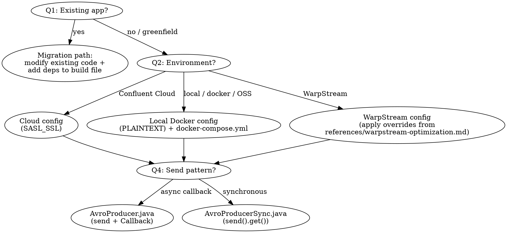

<HARD-GATE>
Do NOT generate any code, scaffold any project, or modify any file until you have
explicitly asked and received answers for questions #1 (existing app or greenfield),
#2 (target environment), and #3 (producer, consumer, or both). If the user's prompt
partially answers some questions, still confirm your understanding before generating.
This applies to EVERY prompt regardless of how specific it appears.
</HARD-GATE>

Begin by announcing: "Using the Confluent Kafka Java Client skill to guide this project."

# Confluent Kafka Java Client Creation

Generate a production-ready Java project for producing to and/or consuming from Kafka using the Apache Kafka Java clients (`KafkaProducer` / `KafkaConsumer`) with Confluent Schema Registry serializers. Supports three target environments: **Confluent Cloud** (managed), **Local Docker**, and **WarpStream** (Kafka-compatible, object-storage-backed); two build tools: **Maven** (default) and **Gradle**; and three schema formats: **Avro** (default), **JSON Schema**, and **Protobuf**. The generated code follows Confluent's best practices.

## Step 1: Gather Requirements

Before generating any code, work through the questions below. **Skip any question the user has already answered explicitly in their prompt** — do not re-ask just for form's sake. For example, "build a producer and consumer on Confluent Cloud with synchronous sends using Gradle" already answers #2, #3, #4, and #5; only #1, #6, #7, #8, #9, and #10 remain.

**Mandatory confirmation gate — do not skip, even if the user answered every question.** Before writing any file, you MUST send one message that:
1. Recaps the answers you extracted as a short bulleted list (e.g., "Target: Confluent Cloud · Components: producer + consumer · Send pattern: async callback · Build: Maven · Schema: Avro · From scratch: yes").
2. Asks any remaining open questions inline.
3. Explicitly asks the user to confirm or correct before you proceed.

Then STOP and wait for the user's reply. Do not generate files in the same turn as the recap, and do not proceed on the assumption that a fully-specified prompt implies consent to generate immediately — the recap catches misinterpretations of the prompt and is required even when questions #1–#10 are all pre-answered. The only way to skip the gate is if the user has already confirmed the recap earlier in this conversation.

Do not assume defaults for #1, #2, or #3 — if any of these are not answered by the prompt, you must ask.

1. **Are you adding Kafka to an existing application, or starting from scratch?**
   - If the user has existing Java code (mentions an existing project, has a `pom.xml`/`build.gradle`, uses Spring Boot/Quarkus/Micronaut, etc.), do **not** scaffold a new project. Instead: (a) identify their existing producer or data-sending code, (b) ask whether they already have schemas registered in Schema Registry, (c) add Schema Registry integration to their existing code following the patterns in the reference files. Generate only the files they are missing (e.g., `KafkaConfig.java`, `src/main/avro/value.avsc`) and modify their existing code inline. Add the Confluent Maven repository and serializer dependencies to their existing build file.
   - If the user already produces to Kafka without Schema Registry (e.g., `StringSerializer` with hand-rolled JSON), help them migrate: (1) generate an Avro/JSON schema from their existing message structure, (2) register it, and (3) replace their raw `String`/`byte[]` serializer with a Confluent Schema Registry serializer. Do not discard their existing code.
   - If starting from scratch, proceed with the full scaffold below.
2. **Target environment?** — Confluent Cloud, local Kafka (Docker), or WarpStream. **Always prompt for this, even if the user didn't mention it.** If they mention "local", "docker", "self-hosted", or just want to try Kafka without a cloud account, choose **local Docker**. If they mention "Confluent Cloud", "CC", or have existing cloud credentials, choose **Confluent Cloud**. If they mention "WarpStream", choose **WarpStream**. Default to Confluent Cloud if they confirm they don't have a preference, but always ask first.
   - **If WarpStream:** Read `references/warpstream-optimization.md` and apply the Java client overrides from that reference. Key changes: disable idempotence, dramatically increase batch sizes and in-flight requests, set large fetch sizes, add `ws_az=<az>` to `client.id` for zone-aware routing. Prefer null message keys for sticky partitioning unless entity-based ordering is required.
3. **Producer, consumer, or both?**
4. **Send pattern?** (Only if producer is requested.) The Java `KafkaProducer.send()` always returns a `Future<RecordMetadata>` — the producer is inherently asynchronous. The choice is how you handle the result. Help the user choose:
   - **Async with callback** (recommended default): `producer.send(record, callback)`. Non-blocking; the `Callback` handles per-record delivery reports and errors. Best throughput for most applications. Use `references/AvroProducer.java`.
   - **Synchronous**: `producer.send(record).get()`. Blocks until the broker acks each record. Lowest throughput but strongest per-message confirmation and simplest error handling. Best for batch/ETL scripts and steps that must confirm one write before the next. Use `references/AvroProducerSync.java`.
   - (Fire-and-forget — `producer.send(record)` with no callback and no `.get()` — is mentioned for completeness but **not** recommended: delivery failures are silently dropped.)
   If the user mentions batch, ETL, or "confirm each write", default to **synchronous**. Otherwise default to **async callback**.
5. **Build tool?** — **Maven** (default, `pom.xml`) or **Gradle** (`build.gradle`). If the user mentions Gradle, an existing `build.gradle`, or Kotlin DSL, use Gradle (`references/build.gradle`). Otherwise default to Maven (`references/pom.xml`).
6. **Do you have an existing schema you'd like to use?** If yes, ask the user to paste it or provide the file path, then use it instead of generating one. If no, proceed to ask about their data fields.
7. **What kind of data are you producing?** (Only if the user doesn't have an existing schema. Get field names and types so you can generate a matching schema and sample data.)
8. **Topic name?** (Default: `demo-topic`)
9. **Consumer group ID?** (Only if consumer; default: `java-consumer-group`)
10. **Consumer API or Share Consumer API?** (Only if consumer is requested.) Help the user choose, explaining the key distinction: with the regular **Consumer API** (`KafkaConsumer`, consumer groups) each partition is assigned to exactly one consumer, so parallelism is capped at the partition count and per-key ordering is preserved. With the **Share Consumer API** (`KafkaShareConsumer`, share groups — "Queues for Kafka") **multiple share consumers can consume from the same partition**, giving **queue-like messaging semantics** where multiple consumers cooperatively process messages concurrently and you can scale consumers beyond the partition count (the trade-off: no per-key ordering, and each record must be acknowledged). **Default to the regular Consumer API.** Choose the Share Consumer API when the user asks for queue/work-queue semantics, competing consumers, cooperative concurrent processing, or scaling consumers independently of partitions. If the user picks the Share Consumer API, read `references/share-consumer.md` before generating — it requires Kafka 4.x clients (the reference build files already pin `kafka.version=4.2.1` / `confluent.version=8.2.1`) and cluster-side feature enablement.

Don't ask whether to use Schema Registry — always include it. **Default to Avro** (idiomatic for the JVM: generated `SpecificRecord` classes give compile-time type safety and a compact wire format). Offer JSON Schema or Protobuf if the user prefers — ask only if they hint at a preference; otherwise use Avro. If the target is WarpStream and the user is using WarpStream's built-in schema registry, note that it only supports Avro and Protobuf (`GET /schemas/types` returns `["AVRO","PROTOBUF"]`) — Avro is already the default, so no change is needed unless they want Protobuf.

### Common Agent Mistakes

| Thought | Reality |
|---------|---------|
| "The user said Spring Boot, so I'll scaffold a fresh Maven project" | If they have an existing app, modify it in place — add deps to their build file and integrate the serializer. Do not scaffold a competing project. |
| "I'll default to JSON Schema like the Python skill" | This skill defaults to **Avro** on the JVM. Generated `SpecificRecord` classes are idiomatic and type-safe. Only use JSON Schema/Protobuf if the user prefers. |
| "I'll leave `auto.register.schemas` at its default" | The serializer default is `true`. Always set it to **`false`** and register explicitly via `CachedSchemaRegistryClient.register(...)`. Silent auto-registration is a production hazard. |
| "I'll create a `KafkaProducer` inside the send method" | One `KafkaProducer` instance, created in `main()`, passed as a parameter. Producers are thread-safe and expensive to create. |
| "I'll write the schema ID into a record header like the Python sync producer" | Java Confluent serializers embed the schema ID in the **wire format** (magic byte + 4-byte ID) automatically. Do not hand-roll headers. |
| "Avro just needs the `.avsc` on the classpath" | Avro `SpecificRecord` classes are **generated at build time** by `avro-maven-plugin` (Maven) or the `com.github.davidmc24.gradle.plugin.avro` plugin (Gradle) from `src/main/avro/*.avsc`. The producer imports the generated class (e.g., `com.example.kafka.Transaction`). Run `mvn generate-sources` / `./gradlew generateAvroJava` before referencing it. |
| "I'll catch and swallow `WakeupException` errors generally" | `WakeupException` is the **expected** signal from `consumer.wakeup()` in a shutdown hook. Catch it narrowly to break the poll loop, then `close()` in `finally`. |
| "Consumer means `KafkaConsumer` — I'll skip asking about the Share Consumer API" | When a consumer is requested, always ask Consumer API vs Share Consumer API (question #10). Default to the regular Consumer API, but offer the Share Consumer API (`KafkaShareConsumer`) for queue-like/cooperative consumption. |
| "I'll forget the Confluent Maven repo — the serializers are on Maven Central" | `io.confluent:kafka-avro-serializer` and friends resolve from `https://packages.confluent.io/maven/`. The build file MUST declare that repository. |
| "`schema.registry.url` goes on the `KafkaProducer` config only" | The serializer reads `schema.registry.url` (and `basic.auth.*`) from the **same** producer/consumer `Properties`. Put SR config in the client properties so the serializer picks it up. |

## Step 1b: Confirm Understanding

After gathering all answers, present a confirmation summary before generating any code:

```
Before I generate the project, let me confirm:
- Project type: [Greenfield scaffold / Migration of existing code]
- Environment: [Confluent Cloud (SASL_SSL) / Local Docker (PLAINTEXT) / WarpStream]
- Schema format: [Avro (default) / JSON Schema / Protobuf]
- Build tool: [Maven / Gradle]
- Components: [Producer only / Consumer only / Both]
- Send pattern: [Async callback / Synchronous] (if producer)
- Consumer API: [Consumer API / Share Consumer API] (if consumer)
- Schema: [brief description of user's data fields]
- Topic: [topic name]
- Consumer group: [group ID] (if consumer)

Does this look right?
```

Wait for user confirmation before proceeding to Step 2. If the user corrects anything, update your understanding and re-confirm.

## Step 2: Generate the Project

### Decision Flowchart



Create this file structure in the user's chosen directory (Maven layout shown; for Gradle the source tree is identical, only the build file differs):

```
<project-dir>/
├── pom.xml                       # Maven (or build.gradle for Gradle)
├── docker-compose.yml            # (local Docker path only)
├── .properties.example           # template for credentials
├── README.md
└── src/
    ├── main/
    │   ├── java/com/example/kafka/
    │   │   ├── KafkaConfig.java   # shared config loading + connectivity verification
    │   │   ├── AvroProducer.java  # (if producer requested; or AvroProducerSync.java)
    │   │   └── AvroConsumer.java  # (if consumer requested; or AvroShareConsumer.java for the Share Consumer API)
    │   └── avro/
    │       └── value.avsc         # Avro schema (codegen source; value.schema.json / value.proto for other formats)
    └── test/
        └── java/com/example/kafka/
            └── AppTest.java       # unit tests (always generated)
```

### Security

NEVER read, open, or display `.properties` files. They contain API keys and secrets. Only generate `.properties.example` with placeholder values. If the user asks you to debug a connection issue, ask them to verify their `.properties` values themselves — do not read the file. Add `.properties` to `.gitignore`.

### Core Principles

These principles matter because they prevent the most common production issues with Kafka Java clients:

1. **Reuse the producer/consumer instance.** Creating a `KafkaProducer` per message is expensive — each one opens TCP connections, does SASL handshakes, and fetches metadata. `KafkaProducer` is thread-safe; create one and share it. The send helper accepts the producer as a parameter, never instantiates one.

2. **Always use Schema Registry, with Avro by default.** Schema Registry enforces a producer/consumer contract; without it, schema changes silently break consumers. This skill defaults to **Avro** because generated `SpecificRecord` classes give the JVM compile-time type safety and a compact wire format. JSON Schema and Protobuf are supported alternatives.

   **Register schemas as a separate explicit step** before producing. Use a dedicated `registerSchema()` method that calls `schemaRegistryClient.register(subject, parsedSchema)` and lets errors (auth failures, network errors, permission denials) propagate immediately — never swallow them. Then configure the serializer with `auto.register.schemas=false` and `use.latest.version=true`. This ensures the serializer never silently auto-registers and aligns with production practice where CI/CD registers schemas, not application startup.

   Use the serializer matching the chosen format:
   - **Avro (default):** `io.confluent.kafka.serializers.KafkaAvroSerializer` / `KafkaAvroDeserializer`. Set `specific.avro.reader=true` on the consumer so it deserializes into the generated `SpecificRecord` class.
   - **JSON Schema:** `io.confluent.kafka.serializers.json.KafkaJsonSchemaSerializer` / `KafkaJsonSchemaDeserializer`. Set `json.value.type` on the consumer to the POJO class. See `references/JsonSchemaProducer.java` and `references/JsonSchemaConsumer.java`.
   - **Protobuf:** `io.confluent.kafka.serializers.protobuf.KafkaProtobufSerializer` / `KafkaProtobufDeserializer`. Generate classes from a `.proto` via `protobuf-maven-plugin` and set `specific.protobuf.value.type` on the consumer.

3. **Choose the send pattern deliberately.** `KafkaProducer.send()` returns `Future<RecordMetadata>` and is always asynchronous internally:
   - **Async with callback** (`references/AvroProducer.java`): `producer.send(record, (metadata, exception) -> {...})`. Non-blocking, best throughput. Recommended default.
   - **Synchronous** (`references/AvroProducerSync.java`): `producer.send(record).get()`. Blocks per record; strongest confirmation, lowest throughput. Best for batch/ETL.
   The consumer is a single-threaded `poll()` loop in both cases.

4. **Graceful shutdown.** Producers must `flush()` then `close()` (in a `finally` block) so buffered records are not lost. Consumers use the **wakeup pattern**: register `Runtime.getRuntime().addShutdownHook(new Thread(consumer::wakeup))`, run the poll loop until `consumer.wakeup()` raises `WakeupException`, catch it narrowly to break the loop, and `close()` in `finally`. `close()` commits offsets and leaves the consumer group cleanly, avoiding unnecessary rebalances.

5. **Support Confluent Cloud, local Docker, and WarpStream.** For Confluent Cloud, configure `SASL_SSL` with `PLAIN` mechanism via `sasl.jaas.config` and load API keys from `.properties`. For local Docker, use `PLAINTEXT` with no authentication. For WarpStream, use `SASL_SSL` or `PLAINTEXT` per the user's deployment and apply the Java overrides from `references/warpstream-optimization.md`. The `KAFKA_ENV` setting (`cloud`, `local`, or `warpstream`) controls which path `KafkaConfig` uses. Load all settings from the `.properties` file via `java.util.Properties` (falling back to process environment variables for any key absent from the file).

6. **Verify connectivity before running.** Use `AdminClient.listTopics()` to confirm the broker is reachable and the topic exists before producing or consuming. Verify Schema Registry connectivity with an HTTP health check against `/subjects`.

7. **Always set a message key for domain events.** Pass the entity identifier as the `ProducerRecord` key for any message representing an entity or event stream (order events, user actions, device telemetry, transactions). Kafka partitions by key, so same-key messages land on the same partition and preserve ordering — critical for streams like `OrderCreated → OrderUpdated → OrderCancelled`. Ask the user which field identifies the entity and use it as the key. Only use a `null` key if the user explicitly states ordering does not matter.

   **WarpStream exception:** On WarpStream, null keys enable sticky partitioning, which builds larger batches and significantly improves throughput and cost. When the use case does **not** require per-entity ordering (independent telemetry, stateless metrics, logs), recommend a null key and explain the throughput benefit. When per-entity ordering **is** required, still set a key — correctness takes priority. Ask the user whether their events need per-key ordering to decide.

### KafkaConfig.java

This class handles configuration loading (via `java.util.Properties`, reading the `.properties` file and falling back to process environment variables) and connectivity verification. Use `references/KafkaConfig.java` as the template. It builds the base client `Properties` (SASL_SSL vs PLAINTEXT by `KAFKA_ENV`), the Schema Registry config keys the serializers read, and the `verifyKafkaSetup` / `verifySchemaRegistry` helpers.

### Producer Patterns

When the user chooses **async callback**, use `references/AvroProducer.java`. When the user chooses **synchronous**, use `references/AvroProducerSync.java`. For JSON Schema, use `references/JsonSchemaProducer.java`. Key points common to all:
- The send helper takes a `KafkaProducer` parameter — it never creates one. The producer is created once in `main()`.
- `registerSchema()` registers explicitly via `CachedSchemaRegistryClient` and returns the schema ID; errors propagate. The serializer is configured with `auto.register.schemas=false`, `use.latest.version=true`.
- The schema ID is embedded automatically in the Confluent wire format — do not add it as a header.
- `flush()` then `close()` in a `finally` block.

### Consumer Pattern

**Regular Consumer API (default).** Use `references/AvroConsumer.java` (or `references/JsonSchemaConsumer.java` for JSON Schema). Key points:
- Deserialize via the Schema Registry deserializer — no raw `String`/JSON fallback.
- Avro: set `specific.avro.reader=true` and consume into the generated `SpecificRecord` type.
- Wakeup-based graceful shutdown: shutdown hook calls `consumer.wakeup()`; the loop catches `WakeupException` and `close()`s in `finally`.
- Continuous `poll(Duration.ofMillis(1000))` loop until shutdown.

**Share Consumer API ("Queues for Kafka").** If the user chose the Share Consumer API in question #10, read `references/share-consumer.md` and use `references/AvroShareConsumer.java` instead of `AvroConsumer.java`. It uses `KafkaShareConsumer` so multiple instances in the same share group cooperatively consume from the same partition (queue-like semantics). Same Schema Registry deserializer and wakeup shutdown as above, plus: per-record `acknowledge(record, AcknowledgeType.ACCEPT/RELEASE/REJECT)` and cluster-side feature enablement (`share.version=1` locally; "Queues for Kafka" enabled on Confluent Cloud). The reference build files already pin Kafka 4.x clients, so no version change is needed — just keep them. Tell the user about the feature requirement.

### Schemas

Generate a schema matching the user's data domain.

**Avro (default):** place the schema at `src/main/avro/value.avsc` so the build plugin generates the `SpecificRecord` class. Use `references/value.avsc` as the starting point and adapt to the user's domain. The record `name` becomes the generated Java class name and `namespace` its package (e.g., `name: "Transaction"`, `namespace: "com.example.kafka"` → `com.example.kafka.Transaction`). Follow `references/schema-generation-rules.md` strictly.

**JSON Schema:** place at `src/main/resources/value.schema.json` and pair it with a POJO. **Protobuf:** place a `.proto` under `src/main/proto/`.

#### Multi-Event Topics (Advanced)

When the user describes multiple event types on a single topic, follow `references/multi-event-guide.md`. Only suggest multi-event/union schemas when the user explicitly describes multiple event types on one topic.

### docker-compose.yml (Local Docker Path Only)

When the user chooses local Docker, you MUST generate a `docker-compose.yml` using `references/docker-compose.yml` as the template. It starts a single-node Kafka broker (`confluentinc/confluent-local`, KRaft mode) and Confluent Schema Registry. The user runs `docker compose up -d`.

**IMPORTANT:** `confluentinc/confluent-local` has built-in listener names `PLAINTEXT` (29092), `PLAINTEXT_HOST` (9092), `CONTROLLER` (29093). Do NOT invent custom listener names — that conflicts with the image's internal config and causes boot loops. Only override `KAFKA_ADVERTISED_LISTENERS` and `KAFKA_LISTENERS` using those exact names. The internal `PLAINTEXT` listener must advertise the `kafka` hostname so Schema Registry can reach the broker inside the Docker network.

### .properties.example

Generate the appropriate `.properties.example` for the target environment. It is a standard Java properties file (`key=value`), loaded by `KafkaConfig` via `java.util.Properties`:

**Confluent Cloud:**
```
KAFKA_ENV=cloud
BOOTSTRAP_SERVER=pkc-xxxxx.us-east-1.aws.confluent.cloud:9092
API_KEY=your-api-key
API_SECRET=your-api-secret
TOPIC=demo-topic
SCHEMA_REGISTRY_URL=https://psrc-xxxxx.us-east-2.aws.confluent.cloud
SR_API_KEY=your-sr-api-key
SR_API_SECRET=your-sr-api-secret
CLIENT_ID=java-client
GROUP_ID=java-consumer-group
```

**Local Docker:**
```
KAFKA_ENV=local
BOOTSTRAP_SERVER=localhost:9092
TOPIC=demo-topic
SCHEMA_REGISTRY_URL=http://localhost:8081
CLIENT_ID=java-client
GROUP_ID=java-consumer-group
```

**WarpStream:**
```
KAFKA_ENV=warpstream
BOOTSTRAP_SERVER=your-warpstream-bootstrap-url:9092
TOPIC=demo-topic
SCHEMA_REGISTRY_URL=http://your-schema-registry:8081
CLIENT_ID=java-client,ws_az=us-east-1a
GROUP_ID=java-consumer-group
# If your WarpStream deployment requires SASL auth, uncomment:
# API_KEY=your-api-key
# API_SECRET=your-api-secret
# If using Confluent Cloud Schema Registry, uncomment:
# SR_API_KEY=your-sr-api-key
# SR_API_SECRET=your-sr-api-secret
```

### Build File

**Maven (default):** use `references/pom.xml`. It declares the Confluent Maven repository, `kafka-clients`, the Avro serializer + `avro` + `avro-maven-plugin` (codegen from `src/main/avro`), a logging binding, and JUnit 5 + Mockito for tests. Configuration is loaded with the JDK's built-in `java.util.Properties` — no extra dependency. Comments show how to swap in the JSON Schema or Protobuf serializer.

**Gradle:** use `references/build.gradle`. Same dependencies plus the `com.github.davidmc24.gradle.plugin.avro` plugin for codegen.

Every dependency imported anywhere in the generated code must appear in the build file. The user should be able to `mvn package` / `./gradlew build` and run with zero unresolved-symbol or `ClassNotFoundException` errors.

### README.md

Generate a README following `references/readme-template.md`. Adapt it to what was actually generated — omit producer sections if only a consumer was requested, omit Docker sections for Confluent Cloud projects, and use the correct build-tool commands.

### Tests

Always generate unit tests at `src/test/java/com/example/kafka/AppTest.java`. Use `references/AppTest.java` as the template. The tests must run without a live Kafka cluster or Schema Registry — use `MockProducer`/`MockConsumer` from `kafka-clients` and Mockito for the Schema Registry client.

The tests verify these properties:

1. **KafkaConfig**: `baseProperties()` produces `SASL_SSL` + `PLAIN` (`sasl.jaas.config` set) when `KAFKA_ENV=cloud`, or `PLAINTEXT` with no SASL when `KAFKA_ENV=local`. `verifyKafkaSetup()` returns the right boolean against a mocked `AdminClient`.
2. **Producer** (if generated): the send helper accepts a producer parameter (never creates one), exactly one `KafkaProducer` is instantiated in the class, and sending a batch through a `MockProducer` records one history entry per message with the expected key. For the sync variant, verify the send result is resolved (`.get()`).
3. **Consumer** (if generated): uses a Schema Registry deserializer (`KafkaAvroDeserializer` / `KafkaJsonSchemaDeserializer` / `KafkaProtobufDeserializer`) — not a raw `StringDeserializer` for values — and uses the wakeup + `close()` shutdown pattern. A `MockConsumer` seeded with records yields the expected deserialized values.
4. **Schema file**: the Avro `value.avsc` parses as a `record` with a top-level `doc` and a `doc` on every field (mirror `references/schema-generation-rules.md`). For JSON Schema, check `type: object`, `title`, descriptions, and `format: date-time` on timestamp fields.

After generating all files, run `mvn test` (or `./gradlew test`) to verify the tests pass. If any test fails, fix the generated code (not the tests) until they pass.

## Step 3: Guide the User

After generating the files, give instructions based on the target environment. Adapt to what was generated.

**Confluent Cloud:**
1. Copy `.properties.example` to `.properties` and fill in Confluent Cloud credentials (bootstrap server, API keys, Schema Registry URL — all in the Confluent Cloud Console under cluster/environment settings).
2. Generate Avro classes and build: `mvn generate-sources && mvn package` (or `./gradlew build`).
3. If a producer was generated, the schema is registered explicitly on first run via `registerSchema()` (`auto.register.schemas=false`). If only a consumer was generated, register the schema manually in the Console under Schema Registry for the topic's value subject.
4. Run the producer: `mvn exec:java -Dexec.mainClass=com.example.kafka.AvroProducer` (or `./gradlew run`).
5. Run the consumer: `mvn exec:java -Dexec.mainClass=com.example.kafka.AvroConsumer`.

**Local Docker:**
1. Start Kafka + Schema Registry: `docker compose up -d`.
2. Copy `.properties.example` to `.properties` (defaults are pre-filled for local Docker).
3. Build: `mvn package` (or `./gradlew build`).
4. Create the topic if auto-creation is disabled: `docker compose exec kafka kafka-topics --create --topic demo-topic --bootstrap-server localhost:29092`.
5. Run the producer / consumer as above.
6. When done: `docker compose down` (add `-v` to remove stored data).

**WarpStream:**
1. Copy `.properties.example` to `.properties` and fill in the WarpStream bootstrap server, Schema Registry URL, and (if applicable) credentials. Set `CLIENT_ID` to include `ws_az=<availability-zone>` for zone-aware routing.
2. Build: `mvn package` (or `./gradlew build`).
3. Create the topic if it doesn't exist.
4. Run the producer / consumer as above.

**If a Share Consumer was generated** (`AvroShareConsumer.java`): before running, the share feature must be enabled on the cluster and the share group's start position configured (see `references/share-consumer.md`). Locally: `docker compose exec kafka kafka-features --bootstrap-server localhost:9092 upgrade --feature share.version=1`, then `kafka-configs --bootstrap-server localhost:9092 --alter --group <group> --add-config share.auto.offset.reset=earliest`. On Confluent Cloud, confirm "Queues for Kafka" is enabled on the (Dedicated) cluster. Run the share consumer with `mvn exec:java -Dexec.mainClass=com.example.kafka.AvroShareConsumer` and start **multiple instances with the same `GROUP_ID`** to see cooperative consumption.

Remind WarpStream users that produce latency (~250ms p50) is higher than standard Kafka — this is expected. If throughput is low, verify the overrides from `references/warpstream-optimization.md` are applied (especially `enable.idempotence=false` and large batch/fetch sizes).
